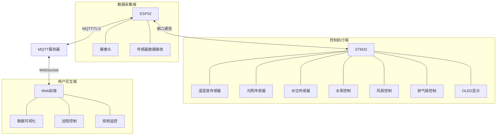
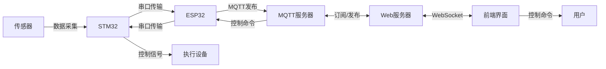
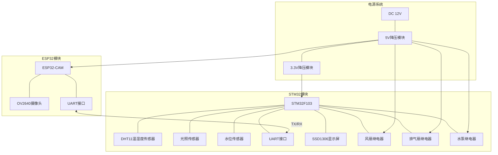
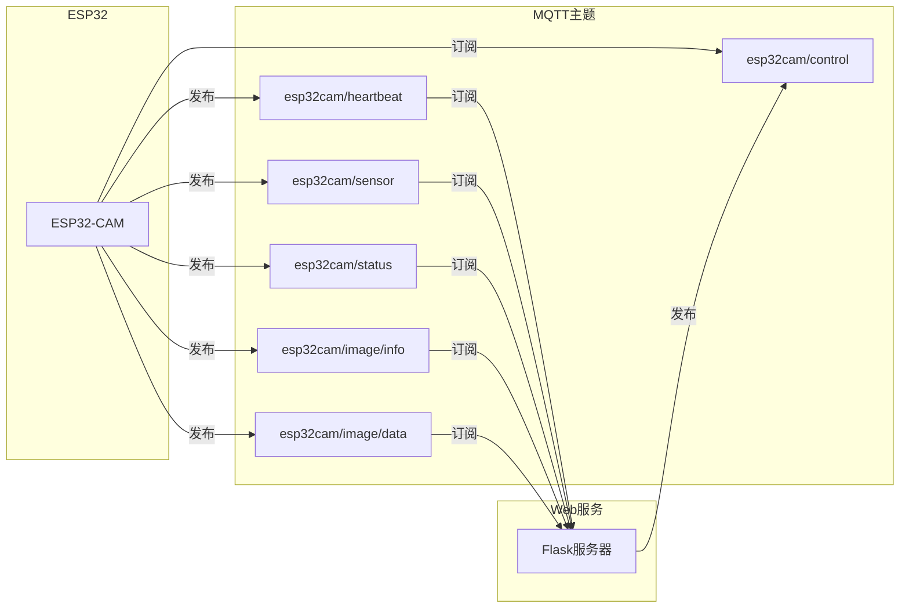
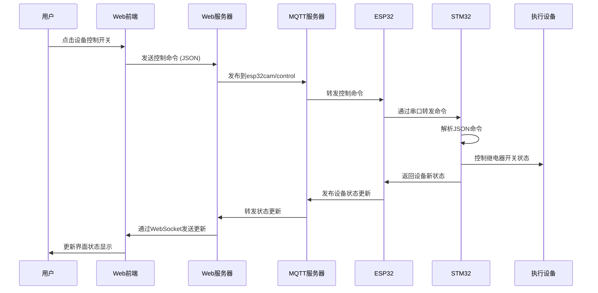
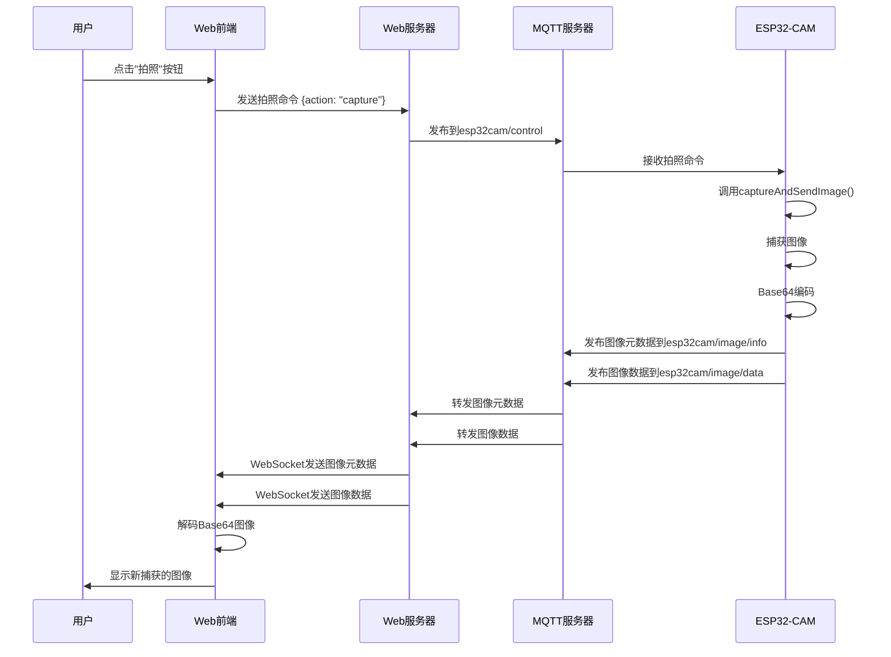
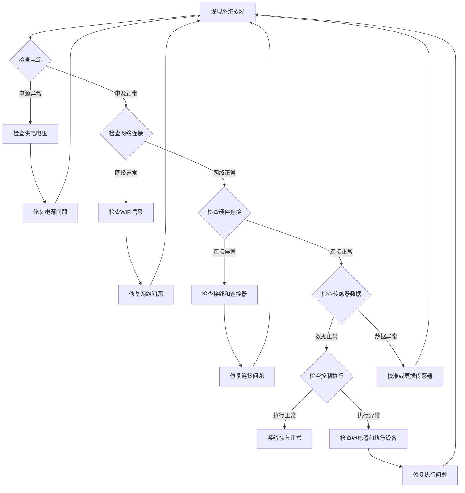
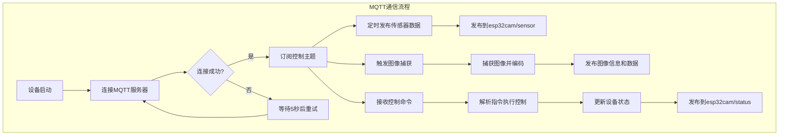
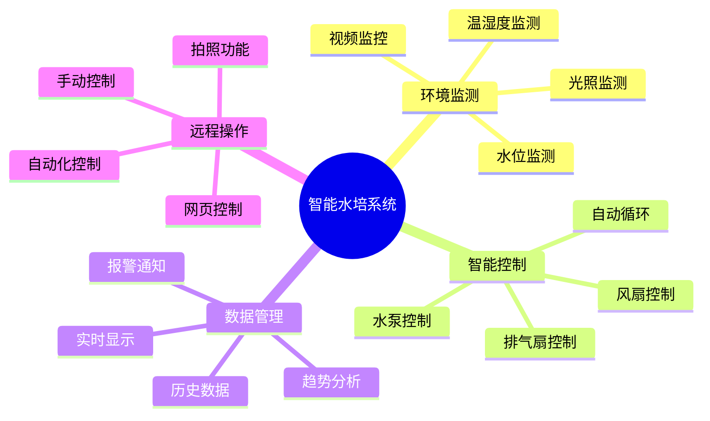

# 基于水培的智能农业系统 - 技术文档

## 1. 系统概述

基于水培的智能农业系统是一套完整的智能监控与控制系统，通过ESP32采集环境数据，STM32控制执行设备，并通过Web前端实现远程监控和控制。系统实现了农业生长环境的智能化管理，提高了农作物产量和质量，降低了人工管理成本。

## 2. 系统架构

### 2.1 总体架构

系统由三大部分组成：
- **数据采集端**：由ESP32单片机负责，连接各类传感器，采集环境数据
- **控制执行端**：由STM32单片机负责，控制水泵、灯光、风扇等执行设备
- **用户交互端**：Web前端界面，用于数据可视化和远程控制



### 2.2 数据流向



## 3. 硬件组成

### 3.1 传感器模块
- 温湿度传感器：监测空气温湿度
- 光照传感器：监测环境光照强度
- 水位传感器：监测水培箱水位
- 电导率(EC)传感器：监测营养液浓度
- pH值传感器：监测营养液酸碱度
- 摄像头(ESP32-CAM)：监控植物生长状态

### 3.2 控制执行模块
- 水泵：控制营养液循环和补充
- LED生长灯：提供植物生长所需光照
- 通风系统：调节生长环境温度
- 加热器：低温环境下维持水温
- 自动加液系统：自动补充营养液和调节pH值

### 3.3 通信模块
- WiFi模块：ESP32内置，用于无线通信
- MQTT协议：实现设备间可靠通信

### 3.5 硬件连接图



## 4. 软件组成

### 4.1 ESP32代码详解

ESP32主要负责数据采集和上传，代码实现了以下功能：

#### 4.1.1 核心功能
- 传感器数据采集与处理
- 数据通过MQTT协议发布
- 接收并处理控制命令
- 摄像头图像采集与传输

#### 4.1.2 代码结构
ESP32代码使用Arduino框架开发，主要依赖以下库：
- PubSubClient：用于MQTT通信
- ArduinoJson：用于JSON数据处理
- WiFi/WiFiClientSecure：用于网络连接

#### 4.1.3 关键流程
1. 系统初始化：初始化传感器、WiFi连接和MQTT客户端
2. 数据采集：定时读取各传感器数据并处理
3. 数据上传：将处理后的数据打包为JSON格式，通过MQTT发布
4. 命令接收：订阅控制主题，接收并执行控制命令

#### 4.1.4 MQTT主题设计
- 心跳主题：`esp32cam/heartbeat` - ESP32发送心跳信息
- 传感器数据主题：`esp32cam/sensor` - 发布所有传感器数据
- 设备状态主题：`esp32cam/status` - 发布所有执行设备的当前状态
- 控制命令主题：`esp32cam/control` - 订阅控制命令
- 图像信息主题：`esp32cam/image/info` - 发布图像元数据信息
- 图像数据主题：`esp32cam/image/data` - 发布Base64编码的图像数据



### 4.2 STM32代码详解

STM32主要负责系统控制，代码实现了以下功能：

#### 4.2.1 核心功能
- 接收并解析控制命令
- 控制各执行设备运行
- 实现PID控制算法调节环境参数
- 故障检测与安全保护

#### 4.2.2 代码结构
STM32使用HAL库开发，主要模块包括：
- 串口通信模块：与ESP32通信
- PWM控制模块：控制水泵、风扇、LED灯等
- 定时器模块：实现定时任务
- 看门狗模块：系统安全保护

#### 4.2.3 关键流程
1. 系统初始化：初始化外设和控制参数
2. 命令接收：通过串口接收ESP32转发的控制命令
3. 命令执行：根据控制命令调整相应设备的工作状态
4. 安全监控：持续监测系统状态，异常时执行安全保护措施

#### 4.2.4 控制策略
- 温度控制：根据温度传感器数据，控制通风系统和加热器
- 光照控制：根据时间和光照传感器数据，调节LED生长灯亮度和颜色
- 水循环控制：定时开启水泵，确保营养液循环
- 营养液管理：根据EC和pH传感器数据，控制自动加液系统

### 4.3 前端代码详解

前端界面提供用户交互和数据可视化，代码实现了以下功能：

#### 4.3.1 核心功能
- 实时数据显示
- 历史数据查询与图表展示
- 远程控制执行设备
- 系统参数设置
- 异常报警通知

#### 4.3.2 代码结构
前端基于Web技术开发，包括：
- HTML/CSS：页面布局和样式
- JavaScript：交互逻辑和数据处理
- WebSocket：实现实时数据更新
- 图表库：数据可视化

#### 4.3.3 界面模块
- 仪表盘：显示核心环境参数
- 控制面板：手动控制各执行设备
- 数据分析：历史数据图表和趋势分析
- 系统设置：调整控制参数和报警阈值
- 视频监控：显示摄像头实时画面

## 5. 系统联动与数据流

### 5.1 数据采集流程
1. ESP32定时读取各传感器数据
2. 数据经过预处理和过滤，去除异常值
3. 数据打包为JSON格式
4. 通过MQTT协议发布到服务器
5. Web服务器接收并存储数据
6. 前端界面通过WebSocket接收并显示数据

### 5.2 控制执行流程



### 5.3 自动控制流程
1. 系统根据传感器数据计算当前环境状态
2. 与设定的目标参数比较，计算偏差
3. 根据PID算法生成控制量
4. 发送控制命令到STM32
5. STM32控制相应设备运行
6. 环境参数改变，传感器检测到新数据
7. 系统进入下一轮控制循环

### 5.4 图像传输流程



## 6. 安装和配置

### 6.1 硬件安装步骤
1. 按照系统图安装传感器
2. 连接执行设备到STM32控制板
3. 连接ESP32与STM32
4. 连接电源

### 6.2 软件配置步骤
1. ESP32程序配置
   - 修改WiFi连接参数
   - 设置MQTT服务器地址
   - 配置传感器校准参数
2. STM32程序配置
   - 设置控制参数
   - 配置设备安全限值
3. 前端配置
   - 设置服务器连接参数
   - 配置用户账号

## 7. 使用说明

### 7.1 系统启动
1. 接通系统电源
2. 等待ESP32连接网络(绿色指示灯常亮)
3. 打开浏览器，输入系统地址
4. 登录系统

### 7.2 日常操作
1. 环境参数监控
   - 查看仪表盘了解实时参数
   - 在数据分析页面查看历史趋势
2. 系统控制
   - 自动模式：设定目标参数，系统自动控制
   - 手动模式：手动控制各设备运行
3. 参数设置
   - 环境参数阈值设置
   - 控制策略调整
   - 报警设置

### 7.3 异常处理
1. 报警解除：处理报警原因后，点击"解除报警"按钮
2. 设备重启：系统异常时，可通过重启按钮重启设备
3. 紧急停止：遇到严重问题时，使用紧急停止功能

## 8. 故障排除

| 故障现象 | 可能原因 | 解决方法 |
|---------|---------|---------|
| ESP32无法连接网络 | WiFi信号弱/配置错误 | 检查WiFi设置/移动设备位置 |
| 传感器数据异常 | 传感器故障/连接问题 | 检查传感器连接/更换传感器 |
| 执行设备不响应 | STM32通信错误/设备故障 | 检查连接/重启STM32/更换设备 |
| 前端显示数据滞后 | 网络延迟/服务器负载高 | 检查网络/优化服务器配置 |
| 系统频繁重启 | 电源不稳定/代码异常 | 检查电源/升级固件 |

### 8.1.通用故障排除步骤



## 9. 维护与升级

### 9.1 日常维护
- 传感器校准：每月校准一次传感器
- 系统清洁：定期清洁水路系统和传感器
- 数据备份：定期备份历史数据

### 9.2 系统升级
- ESP32固件升级
- STM32固件升级
- 前端界面升级

## 10. 技术规格

### 10.1 ESP32规格
- 型号：ESP32-WROOM-32
- CPU：双核Tensilica LX6，主频240MHz
- 内存：520KB SRAM
- 存储：4MB Flash
- 无线：WiFi 802.11 b/g/n + Bluetooth 4.2

### 10.2 STM32规格
- 型号：STM32F103
- CPU：ARM Cortex-M3，主频72MHz
- 内存：20KB SRAM
- 存储：64/128KB Flash
- 接口：UART、SPI、I2C、ADC、PWM等

### 10.3 传感器规格
- 温度精度：±0.5℃
- 湿度精度：±3%RH
- EC测量范围：0-5mS/cm
- pH测量范围：0-14
- 图像分辨率：1280×1024

## 11. 附录

### 11.1 系统源代码目录结构
```
基于水培的智能农业系统
├─esp32代码        // ESP32数据采集模块代码
│  ├─.pio          // PlatformIO配置
│  ├─src           // 源代码
│  └─lib           // 库文件
├─stm32代码        // STM32控制模块代码
│  ├─Core          // 核心代码
│  │  ├─Inc        // 头文件
│  │  └─Src        // 源文件
│  └─Drivers       // 驱动文件
└─前端代码         // Web前端界面代码
    ├─static       // 静态资源
    └─templates    // 页面模板
```

### 11.2 通信协议详情
#### 11.2.1 MQTT通信协议

系统中的MQTT通信使用TLS加密，确保数据传输安全。配置如下：
- MQTT服务器: `n09f9099.ala.cn-hangzhou.emqxsl.cn`
- 端口: `8883` (TLS加密)
- 客户端认证: 用户名/密码认证



#### 11.2.2 JSON数据格式

1. 传感器数据格式:
```json
{
  "water": "85%",
  "temp": "25.6C",
  "humi": "68.3%",
  "light": "3500.0lux"
}
```

2. 设备状态格式:
```json
{
  "fan": "on",
  "exh": "off",
  "pum": "on"
}
```

3. 控制命令格式:
```json
{
  "fan": "on",
  "exh": "off",
  "pum": "on"
}
```

4. 图像信息格式:
```json
{
  "width": 160,
  "height": 120,
  "format": "jpeg",
  "timestamp": 1623421789
}
```

#### 11.2.3 STM32与ESP32之间的串口通信

STM32和ESP32之间通过UART进行通信，波特率为115200。通信格式如下：

1. STM32发送给ESP32的传感器数据:
```json
{"water":"85%","temp":"25.6C","humi":"68.3%","light":"3500.0lux","fan":"off","exh":"off","pum":"on"}
```

2. ESP32发送给STM32的控制命令:
```json
{"fan":"on","exh":"off","pum":"on"}
```

STM32接收到控制命令后，会解析JSON数据并执行相应的操作。命令执行后的状态变更会在下一次数据发送时上报。

### 11.3 参考资料
- ESP32官方文档
- STM32F1系列参考手册
- MQTT协议规范
- 水培种植技术指南

### 11.4 系统功能详解

#### 11.4.1 系统功能特点



#### 11.4.2 硬件详细说明

##### ESP32-CAM模块
- **主控芯片**：ESP32-S
- **内存**：520KB SRAM + 4MB PSRAM
- **摄像头**：OV2640，支持多种分辨率
- **接口**：
  - GPIO引脚用于控制和通信
  - UART用于与STM32通信
  - SD卡接口用于本地存储

##### STM32控制模块
- **主控芯片**：STM32F103C8T6
- **传感器接口**：
  - PA0：DHT11温湿度传感器
  - PA4(ADC1_IN4)：光照传感器
  - PA5(ADC1_IN5)：水位传感器
- **执行设备控制接口**：
  - PC13：风扇继电器(低电平有效)
  - PC14：排气扇继电器(低电平有效)
  - PC15：水泵继电器(低电平有效)
- **显示接口**：
  - PB8/PB9：I2C接口，用于连接SSD1306 OLED显示屏

##### 传感器模块详细参数
- **DHT11温湿度传感器**：
  - 测量范围：温度0~50℃，湿度20~90%RH
  - 精度：温度±2℃，湿度±5%RH
  - 供电电压：3.3~5V DC
  - 采样周期：≥1s

- **光照传感器(光敏电阻)**：
  - 暗阻值：10KΩ
  - 光照范围：0~10000 Lux
  - 转换公式：`lux = maxLux * pow(normalizedValue, 2.5f)`
  - 供电电压：3.3V DC

- **水位传感器**：
  - 类型：电容式水位检测
  - 测量范围：0~100%
  - 供电电压：3.3V DC
  - 转换公式：`percent = (float)adcValue / 4095.0f * 100.0f`

#### 11.4.3 软件实现细节

##### ESP32代码核心实现

摄像头初始化：
```cpp
void setupCamera() {
  camera_config_t config;
  config.ledc_channel = LEDC_CHANNEL_0;
  config.ledc_timer = LEDC_TIMER_0;
  config.pin_d0 = Y2_GPIO_NUM;
  // 省略其他引脚配置...
  
  // 检测PSRAM并根据情况调整图像质量
  if (psramFound()) {
    config.jpeg_quality = 10;  // 更高质量
    config.fb_count = 2;
    config.grab_mode = CAMERA_GRAB_LATEST;
  } else {
    // PSRAM不可用时降低分辨率
    config.frame_size = FRAMESIZE_SVGA;
    config.fb_location = CAMERA_FB_IN_DRAM;
  }
  
  // 初始化摄像头
  esp_err_t err = esp_camera_init(&config);
  if (err != ESP_OK) {
    // 错误处理...
  }
}
```

MQTT通信实现：
```cpp
void setupMQTT() {
  // 设置服务器和证书
  espClient.setCACert(ca_cert);
  client.setServer(mqtt_server, mqtt_port);
  client.setCallback(callback);
}

void callback(char *topic, byte *payload, unsigned int length) {
  // 处理收到的MQTT消息
  if (strcmp(topic, mqtt_control_topic) == 0) {
    // 解析命令JSON并执行相应操作
    // ...
  }
}
```

图像捕获与发送：
```cpp
void captureAndSendImage() {
  camera_fb_t *fb = esp_camera_fb_get();
  if (!fb) {
    // 处理错误...
    return;
  }
  
  // 将图像转换为Base64
  String imageBase64 = base64_encode(fb->buf, fb->len);
  
  // 通过MQTT发送
  client.publish(mqtt_image_data_topic, imageBase64.c_str());
  
  // 释放帧缓冲区
  esp_camera_fb_return(fb);
}
```

##### STM32代码核心实现

传感器数据采集：
```c
static void ReadSensors(void) {
  // 配置为光线传感器通道
  ADC_ChannelConfTypeDef sConfig = {0};
  sConfig.Channel = ADC_CHANNEL_4;
  sConfig.Rank = 1;
  sConfig.SamplingTime = ADC_SAMPLETIME_55CYCLES_5;
  HAL_ADC_ConfigChannel(&hadc1, &sConfig);

  // 读取光线传感器值
  HAL_ADC_Start(&hadc1);
  HAL_ADC_PollForConversion(&hadc1, 100);
  lightValue = HAL_ADC_GetValue(&hadc1);
  HAL_ADC_Stop(&hadc1);

  // 将光敏电阻ADC值转换为流明
  luxValue = ConvertToLux(lightValue);

  // 配置为水位传感器通道并读取...
  
  // 读取DHT11温湿度传感器数据
  DHT_data dhtData = DHT_getData(&dht11);
  if (dhtData.temp > -100.0f && dhtData.hum > -100.0f) {
    temperature = dhtData.temp;
    humidity = dhtData.hum;
    dht11Ready = 1;
  } else {
    // 传感器读取失败处理
  }
}
```

设备控制实现：
```c
static void UpdateDeviceStatus(uint8_t fan, uint8_t exhaust, uint8_t pump) {
  // 更新风扇状态
  if (fan) {
    HAL_GPIO_WritePin(RELAY_FAN_PORT, RELAY_FAN_PIN, RELAY_ON);
  } else {
    HAL_GPIO_WritePin(RELAY_FAN_PORT, RELAY_FAN_PIN, RELAY_OFF);
  }
  
  // 更新排气扇状态
  if (exhaust) {
    HAL_GPIO_WritePin(RELAY_EXHAUST_PORT, RELAY_EXHAUST_PIN, RELAY_ON);
  } else {
    HAL_GPIO_WritePin(RELAY_EXHAUST_PORT, RELAY_EXHAUST_PIN, RELAY_OFF);
  }
  
  // 更新水泵状态
  if (pump) {
    HAL_GPIO_WritePin(RELAY_PUMP_PORT, RELAY_PUMP_PIN, RELAY_ON);
  } else {
    HAL_GPIO_WritePin(RELAY_PUMP_PORT, RELAY_PUMP_PIN, RELAY_OFF);
  }
  
  // 更新状态变量
  fanStatus = fan;
  exhaustStatus = exhaust;
  pumpStatus = pump;
}
```

##### 前端实现细节

Flask后端核心实现：
```python
# MQTT客户端回调函数
def on_message(client, userdata, msg):
    topic = msg.topic
    
    # 特殊处理图像数据
    if topic == mqtt_image_data_topic:
        try:
            image_base64 = msg.payload.decode('utf-8')
            latest_data['image_data'] = {
                'timestamp': time.strftime('%Y-%m-%d %H:%M:%S'), 
                'data': image_base64
            }
            
            # 通过WebSocket发送到前端
            socketio.emit('mqtt_message', {
                'topic': topic,
                'data': {"data": image_base64},
                'timestamp': time.strftime('%Y-%m-%d %H:%M:%S')
            })
        except Exception as e:
            print(f"处理图像数据时出错: {e}")
    else:
        # 处理其他类型的数据
        # ...
```

前端WebSocket处理：
```javascript
// WebSocket连接和消息处理
const socket = io();

socket.on('connect', function() {
    setConnectionStatus(true);
    addLogMessage('已连接到服务器');
});

socket.on('mqtt_message', function(data) {
    // 处理不同类型的消息
    if (data.topic === 'esp32cam/sensor') {
        updateSensorData(data.data);
    } else if (data.topic === 'esp32cam/status') {
        updateDeviceStatus(data.data);
    } else if (data.topic === 'esp32cam/image/data') {
        updateCameraImage(data.data.data);
    }
    
    // 添加到日志
    addLogMessage(`收到主题 [${data.topic}] 的消息`);
});
```

#### 11.4.4 系统控制流程

##### 自动控制策略

```c
// 自动控制函数
static void AutoControl(void) {
  // 温度控制策略
  if (temperature > 30.0f) {
    // 温度过高，开启风扇和排气扇
    UpdateDeviceStatus(1, 1, pumpStatus);
  } else if (temperature < 18.0f) {
    // 温度过低，关闭风扇和排气扇
    UpdateDeviceStatus(0, 0, pumpStatus);
  }
  
  // 湿度控制策略
  if (humidity > 80.0f) {
    // 湿度过高，开启排气扇
    UpdateDeviceStatus(fanStatus, 1, pumpStatus);
  } else if (humidity < 40.0f) {
    // 湿度过低，关闭排气扇
    UpdateDeviceStatus(fanStatus, 0, pumpStatus);
  }
  
  // 水泵控制策略 - 定时循环
  static uint32_t pumpTimer = 0;
  if (HAL_GetTick() - pumpTimer >= PUMP_CYCLE_INTERVAL) {
    // 定时开启水泵15秒
    UpdateDeviceStatus(fanStatus, exhaustStatus, 1);
    pumpTimer = HAL_GetTick();
    
    // 设置关闭定时器
    pumpOffTimer = HAL_GetTick();
    pumpOffFlag = 1;
  }
  
  // 水泵自动关闭
  if (pumpOffFlag && (HAL_GetTick() - pumpOffTimer >= PUMP_ON_DURATION)) {
    UpdateDeviceStatus(fanStatus, exhaustStatus, 0);
    pumpOffFlag = 0;
  }
}
```

##### 数据发送流程

STM32将数据发送给ESP32：
```c
static void SendSensorData(void) {
    // 构建JSON格式数据
    sprintf(txBuffer, 
            "{\"temp\":%.1f,\"humi\":%.1f,\"light\":%.1f,\"water\":%d,\"fan\":%d,\"exhaust\":%d,\"pump\":%d}",
            temperature, humidity, luxValue, waterValue, 
            fanStatus, exhaustStatus, pumpStatus);
    
    // 通过UART发送到ESP32
    HAL_UART_Transmit(&huart2, (uint8_t*)txBuffer, strlen(txBuffer), 100);
    HAL_UART_Transmit(&huart2, (uint8_t*)"\n", 1, 10);
}
```

ESP32接收并转发到MQTT：
```cpp
void parseJsonData(String jsonStr) {
  // 解析从STM32收到的JSON数据
  DynamicJsonDocument doc(1024);
  deserializeJson(doc, jsonStr);
  
  // 提取数据
  temperature = doc["temp"].as<String>();
  humidity = doc["humi"].as<String>();
  lightLevel = doc["light"].as<String>();
  waterLevel = doc["water"].as<String>();
  
  // 通过MQTT发布数据
  publishSensorData();
}
```

#### 11.4.5 系统安装调试详细步骤

1. **硬件组装**
   - 按照电路图完成所有组件连接
   - 确认所有传感器安装位置正确
   - 检查电源连接和电压

2. **ESP32程序烧录**
   - 使用PlatformIO或Arduino IDE编译程序
   - 按住Boot按钮后按下Reset按钮进入下载模式
   - 完成固件烧录后按下Reset按钮重启

3. **STM32程序烧录**
   - 使用ST-Link连接STM32开发板
   - 通过STM32CubeProgrammer烧录固件
   - 断开ST-Link后重启STM32板

4. **系统调试**
   - 通过ESP32串口监视器检查WiFi和MQTT连接状态
   - 确认STM32读取的传感器数据正确
   - 测试控制命令是否能正确执行
   - 检查前端界面是否正常显示数据

#### 11.4.6 系统扩展功能

##### 添加EC/pH传感器支持
EC传感器测量代码：
```c
// 读取EC传感器
void ReadECSensor(void) {
  // 配置ADC通道
  ADC_ChannelConfTypeDef sConfig = {0};
  sConfig.Channel = ADC_CHANNEL_6;  // 假设EC传感器连接到PA6
  sConfig.Rank = 1;
  sConfig.SamplingTime = ADC_SAMPLETIME_55CYCLES_5;
  HAL_ADC_ConfigChannel(&hadc1, &sConfig);
  
  // 读取ADC值
  HAL_ADC_Start(&hadc1);
  HAL_ADC_PollForConversion(&hadc1, 100);
  uint16_t adcValue = HAL_ADC_GetValue(&hadc1);
  HAL_ADC_Stop(&hadc1);
  
  // 将ADC值转换为EC值
  // EC单位: mS/cm
  ecValue = (float)adcValue * EC_CONVERSION_FACTOR;
}
```

##### 添加自动施肥系统
自动施肥控制代码：
```c
// 营养液管理
void ManageNutrition(void) {
  // 根据EC值控制施肥系统
  if (ecValue < MIN_EC_VALUE) {
    // EC值过低，需要添加营养液
    // 启动营养液添加泵15秒
    HAL_GPIO_WritePin(RELAY_NUTRIENT_PORT, RELAY_NUTRIENT_PIN, RELAY_ON);
    nutrientPumpOn = 1;
    nutrientTimer = HAL_GetTick();
  }
  
  // 检查是否需要关闭营养液泵
  if (nutrientPumpOn && (HAL_GetTick() - nutrientTimer >= NUTRIENT_PUMP_DURATION)) {
    HAL_GPIO_WritePin(RELAY_NUTRIENT_PORT, RELAY_NUTRIENT_PIN, RELAY_OFF);
    nutrientPumpOn = 0;
  }
  
  // 处理pH值
  if (phValue < MIN_PH_VALUE) {
    // pH过低，添加碱性调节剂
    HAL_GPIO_WritePin(RELAY_PH_UP_PORT, RELAY_PH_UP_PIN, RELAY_ON);
    phUpPumpOn = 1;
    phTimer = HAL_GetTick();
  } else if (phValue > MAX_PH_VALUE) {
    // pH过高，添加酸性调节剂
    HAL_GPIO_WritePin(RELAY_PH_DOWN_PORT, RELAY_PH_DOWN_PIN, RELAY_ON);
    phDownPumpOn = 1;
    phTimer = HAL_GetTick();
  }
  
  // 检查是否需要关闭pH调节泵
  if ((phUpPumpOn || phDownPumpOn) && (HAL_GetTick() - phTimer >= PH_PUMP_DURATION)) {
    HAL_GPIO_WritePin(RELAY_PH_UP_PORT, RELAY_PH_UP_PIN, RELAY_OFF);
    HAL_GPIO_WritePin(RELAY_PH_DOWN_PORT, RELAY_PH_DOWN_PIN, RELAY_OFF);
    phUpPumpOn = 0;
    phDownPumpOn = 0;
  }
}
```

### 11.5 系统维护和故障诊断

#### 11.5.1 常见系统故障及解决方案

除了主文档中提到的故障外，以下是更详细的常见故障排除方法：

1. **OLED显示屏无显示**
   - 故障原因：I2C连接问题、初始化失败
   - 排查步骤：
     1. 确认VCC和GND电源连接正确
     2. 检查I2C引脚连接(PB8/PB9)
     3. 使用万用表测量I2C引脚电平
   - 解决方法：重新检查连接，确保I2C地址设置正确，重新初始化OLED

2. **DHT11读取失败**
   - 故障原因：连接问题、供电不足、传感器故障
   - 排查步骤：
     1. 检查DHT11的VCC和GND连接
     2. 确认信号线(PA0)连接正确
     3. 更换一个新的DHT11测试
   - 解决方法：重新连接DHT11，确保供电电压正常，如仍无法解决则更换传感器

3. **继电器不动作**
   - 故障原因：控制信号异常、继电器故障、供电不足
   - 排查步骤：
     1. 测量继电器控制引脚的电平
     2. 检查继电器模块电源是否正常
     3. 手动将控制引脚拉低测试继电器
   - 解决方法：确认继电器驱动逻辑，检查控制程序，必要时更换继电器模块

4. **ESP32无法发送图像**
   - 故障原因：摄像头连接问题、内存不足、MQTT消息过大
   - 排查步骤：
     1. 检查摄像头连接和初始化状态
     2. 降低图像分辨率测试
     3. 监控ESP32内存使用情况
   - 解决方法：重新配置摄像头参数，降低分辨率，增加MQTT消息大小限制
